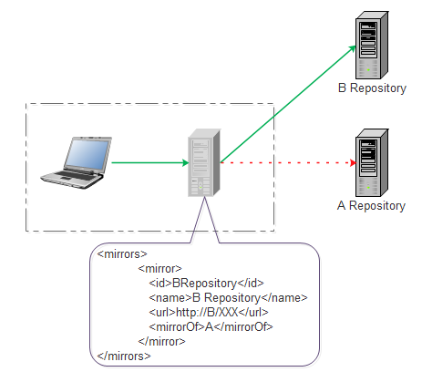
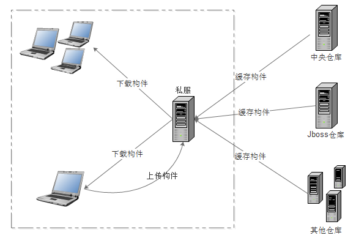

##maven 配置

###配置释义
`<moudelVersion>` 模型版本

`<groupId>`  公司或者组织的唯一标志，并且配置时生成的路径也是由此生成， 如com.winner.trade，maven会将该项目打成的jar包放本地路径：/com/winner/trade

`<artfactid>` 本项目的唯一id 用于区分groupId
 
###repository和mirrors区别
- 1.repository(仓库)

   
   
   1. Maven仓库主要有2种：

          分两种remote repository 和 local repository
 
   2. remote repository 主要分三种
     
          中央仓库 http://repo1.maven.org/maven2/ 
          私服 内网建的repository
          其他公共仓库
          
- 2.Mirrors
       
      mirror相当于一个拦截器，会拦截remote repository的请求，重定向到mirror里配置的地址。
        
    1. 没有配置mirror
    
        
    
    2. 配置mirror
    
         
         
    3. 配置 `<mirrorOf> </mirrorOf>`
    
           <mirrorOf></mirrorOf>标签里面放置的是要被镜像的Repository ID。为了满足一些复杂的需求，Maven还支持更高级的镜像配置： 
        
           <mirrorOf>*</mirrorOf> 
        
                    匹配所有远程仓库。 
        
           <mirrorOf>repo1,repo2</mirrorOf> 
        
                    匹配仓库repo1和repo2，使用逗号分隔多个远程仓库。 
        
           <mirrorOf>*,!repo1</miiroOf> 
        
                    匹配所有远程仓库，repo1除外，使用感叹号将仓库从匹配中排除。 
                    
                    
- 3.repository和mirror

     1. 定义
             
            mirorr定义两个repository之间的关系，在maven配置里配置<mirorr></mirror>及定义了两个repository之间的镜像关系。
             
     2. 目的
            
            访问速度和下载速度
             
     3. 注意
            
            由于镜像仓库完全屏蔽了被镜像仓库，当镜像仓库不稳定或者停止服务的时候，Maven仍将无法访问被镜像仓库，因而将无法下载构件
            
     4. 私服
            
            私服是一种特殊的远程Maven仓库，它是架设在局域网内的仓库服务，私服一般被配置为互联网远程仓库的镜像，供局域网内的Maven用户使用。
            
            当Maven需要下载构件的时候，先向私服请求，如果私服上不存在该构件，则从外部的远程仓库下载，同时缓存在私服之上，然后为Maven下载请求提供下载服务，另外，对于自定义或第三方的jar可以从本地上传到私服，供局域网内其他maven用户使用。
        
            优点主要有：
            
            节省外网宽带
            
            加速Maven构建
            
            部署第三方构件
            
            提高稳定性、增强控制：原因是外网不稳定
            
            降低中央仓库的负荷：原因是中央仓库访问量太大
            
           
   
        
